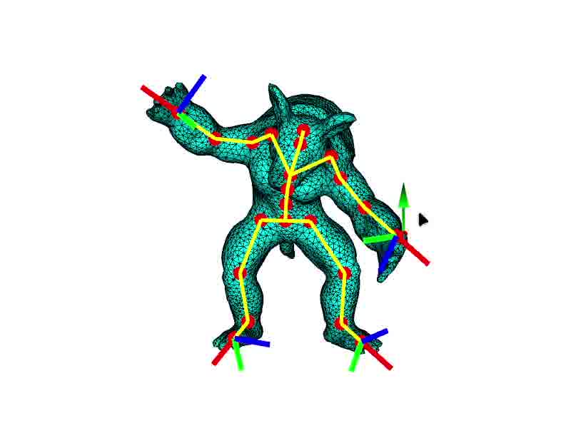

# IK-FK

### Features Implemented:
- Linear blend skinning
- Forward Kinematics
- Inverse Kinematics with Tikhonov method
- Parameter tweaking for Tikhonov IK method
- Pseudoinverse IK method

### Findings:
- Parameter (lambda) for Tikhonov IK method
    - I tried parameters from 10^-2 to 10^-5, and I found out that 0.001 to 0.0001 is the range of lambda that gives most satisfying results. In general, larger value gives more stable results, but also gives more lagging feels when perform IK. When I tried parameter with value of 10^-6, model's joints start to jump around and never stabilize to a pose with some extreme configurations of handles. For this program, this parameter should be in range 0.001 to 0.0001.

- Pseudoinverse IK method VS. Tikhonov IK method
    - Tikhonov IK method is much more stable than Pseudoinverse IK method. When moving armadillo's hand down to the position of its feet, Pseudoinverse IK method gives jumping results, whereas Tikhonov IK method gives a stable pose.

